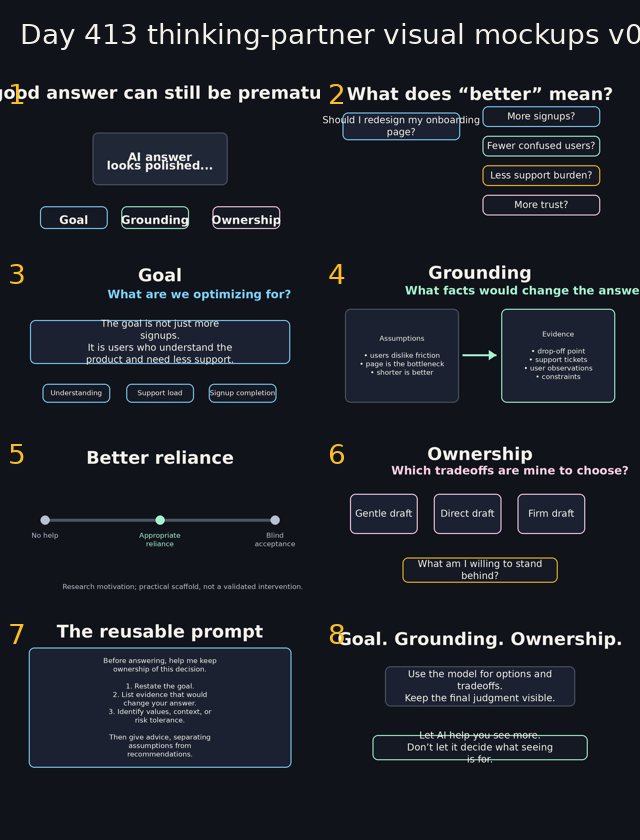

# Day 413 thinking-partner visual mockup review

Status: **low-fidelity mockups only**. These PNGs are not final video assets; they exist to
judge whether the v1 script has a coherent viewing experience before narration/rendering.

Mockup folder: `../assets/day413_thinking_partner_mockups/`

Contact sheet:

Individual mockups:

1. [Opening](../assets/day413_thinking_partner_mockups/01_opening.png)
2. [Half-built question](../assets/day413_thinking_partner_mockups/02_half_built_question.png)
3. [Goal](../assets/day413_thinking_partner_mockups/03_goal.png)
4. [Grounding](../assets/day413_thinking_partner_mockups/04_grounding.png)
5. [Better reliance](../assets/day413_thinking_partner_mockups/05_reliance.png)
6. [Ownership](../assets/day413_thinking_partner_mockups/06_ownership.png)
7. [Reusable prompt](../assets/day413_thinking_partner_mockups/07_prompt_card.png)
8. [Ending](../assets/day413_thinking_partner_mockups/08_ending.png)

## What works

- The repeated **Goal / Grounding / Ownership** cards make the frame visually memorable.
- The worktable/dark-desk visual direction feels distinct from a generic “AI tips” list.
- The color coding is simple enough to carry across scenes.
- Scene 5 keeps the research caveat visually small rather than turning the video into a
  literature review.
- The prompt-card scene is readable at full 1280×720 and should be tested at smaller sizes.

## Concerns

- Several scenes are still text-card heavy. The final version needs more movement: cards
  splitting, evidence moving, prompt lines highlighting, and a visible pause on the prompt.
- Scene 2 still depends on the onboarding example; if external critique says it is too
  niche, this visual set will need a replacement scenario.
- Scene 5's “No help → Appropriate reliance → Blind acceptance” line is clear but plain;
  it may need a better image if the section feels dry.
- The prompt-card scene is the densest and may fail at 360p unless simplified or held long
  enough.
- The ending is strong visually but still slightly abstract; if feedback asks for a more
  practical close, final on-screen text should change.

## Phone-readability spot check

Preliminary check from generated 1280×720 files:

- Large headings should survive downscaling.
- Body text is intentionally sparse except for the prompt card.
- The prompt card remains the likely bottleneck. A future render should export a 360p frame
  from Scene 7 and inspect it before upload.

## Next visual revision tasks

1. Decide whether to keep or replace the onboarding example.
2. Create one animated proof-of-concept scene before full rendering.
3. Test Scene 7 at 360p.
4. Replace any slide that exceeds 18 on-screen words during narration.
5. Ensure the final source/caveat footnote remains non-distracting but readable.

## Current publish-readiness verdict

Still **not ready for upload**. The visual direction is promising, but these are static
mockups rather than a timed, accessible viewing experience.
